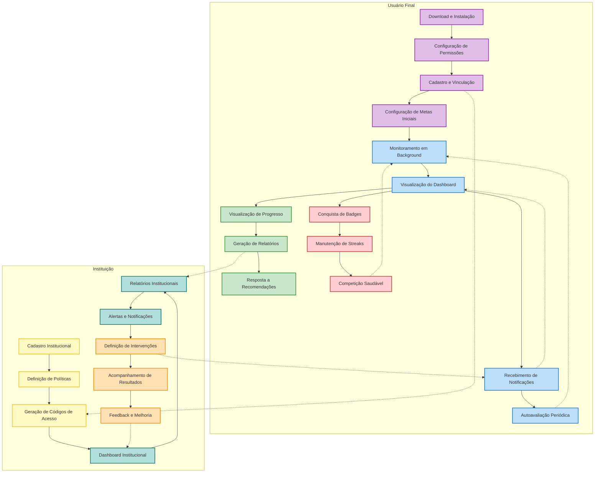

# Conexão Saudável - Backend

[](https://github.com/seu-usuario/conexao-saudavel)
[](https://github.com/Conexao-Saudavel/server-conexao-saudavel)
[](LICENSE)

## 📋 Sobre o Projeto

O Conexão Saudável é uma solução inovadora para monitoramento e gestão do uso saudável de dispositivos móveis em instituições educacionais e corporativas. O projeto visa combater o uso excessivo de dispositivos móveis, que pode comprometer o desempenho acadêmico e profissional, além de estar associado ao aumento de ansiedade e isolamento social.

### 🎯 Objetivos Principais

- Fornecer métricas confiáveis para instituições estabelecerem políticas de uso saudável
- Implementar um sistema de monitoramento nativo e eficiente
- Criar uma experiência gamificada para engajamento dos usuários
- Gerar relatórios detalhados e personalizados
- Oferecer um sistema de autoavaliação periódica

## 🚀 Funcionalidades Principais

### Diagrama de Fluxo de Interação




### 1. Coleta de Dados
- Monitoramento nativo de uso de aplicativos
- Registro de eventos em background
- Armazenamento local com SQLite
- Sincronização automática com o servidor

### 2. Sistema de Autoavaliação
- Questionários periódicos (14 dias)
- Métricas de engajamento
- Análise de progresso

### 3. Relatórios e Analytics
- Geração de PDFs personalizados
- Dashboard institucional
- Métricas agregadas por turma/curso/setor

### 4. Gamificação
- Sistema de pontos e conquistas
- Streaks de uso saudável
- Badges e recompensas

## 🛠️ Tecnologias Utilizadas

- **Backend**: Node.js com Express.js
- **Banco de Dados**: PostgreSQL
- **ORM**: TypeORM
- **Cache**: Redis
- **Filas**: Bull
- **Monitoramento**: Sentry
- **Testes**: Jest
- **Documentação**: OpenAPI/Swagger

## 📁 Estrutura do Projeto

```
server-repo/
├── src/                    # Código fonte
│   ├── config/            # Configurações
│   ├── entities/          # Modelos TypeORM
│   ├── repositories/      # Camada de acesso a dados
│   ├── services/         # Lógica de negócio
│   ├── controllers/      # Controladores da API
│   ├── routes/           # Rotas da API
│   ├── middlewares/      # Middlewares Express
│   ├── dtos/            # Data Transfer Objects
│   ├── validations/     # Schemas de validação
│   ├── utils/           # Utilitários
│   ├── queue/           # Processamento em background
│   └── errors/          # Classes de erro
├── tests/               # Testes
├── docs/               # Documentação
├── logs/              # Logs da aplicação
└── scripts/          # Scripts utilitários
```

## 🚀 Como Executar

### Pré-requisitos

- Node.js 18+
- PostgreSQL 14+
- Redis 6+
- Yarn ou npm

### Instalação

1. Clone o repositório:
```bash
git clone https://github.com/Conexao-Saudavel/server-conexao-saudavel
cd conexao-saudavel
```

2. Instale as dependências:
```bash
yarn install
```

3. Configure as variáveis de ambiente:
```bash
cp .env.example .env
# Edite o arquivo .env com suas configurações
```

4. Execute as migrações:
```bash
yarn migration:run
```

5. Inicie o servidor:
```bash
yarn dev
```

## 🧪 Testes

```bash
# Testes unitários
yarn test:unit

# Testes de integração
yarn test:integration

# Testes e2e
yarn test:e2e

# Cobertura de testes
yarn test:coverage
```

## 📊 Métricas de Qualidade

- Cobertura de testes: ≥85%
- Latência de resposta: <200ms
- Score SUS móvel: ≥85
- Disponibilidade: 99.9%

## 🤝 Contribuindo

1. Fork o projeto
2. Crie sua branch de feature (`git checkout -b feature/AmazingFeature`)
3. Commit suas mudanças (`git commit -m 'Add some AmazingFeature'`)
4. Push para a branch (`git push origin feature/AmazingFeature`)
5. Abra um Pull Request

## 📝 Licença

Este projeto está sob a licença MIT. Veja o arquivo [LICENSE](LICENSE) para mais detalhes.

## 🙏 Agradecimentos

- Todos os contribuidores que dedicaram seu tempo ao projeto
- Instituições parceiras que validaram a solução
- Comunidade open source que forneceu as ferramentas essenciais

---

Desenvolvido com ❤️ pela Equipe Conexão Saudável 