# Conexão Saudável - Backend

[](https://github.com/seu-usuario/conexao-saudavel)
[](https://github.com/Conexao-Saudavel/server-conexao-saudavel)
[](LICENSE)

## 📋 Sobre o Projeto

O Conexão Saudável é uma solução inovadora para monitoramento e gestão do uso saudável de dispositivos móveis em instituições educacionais e corporativas. O projeto visa combater o uso excessivo de dispositivos móveis, que pode comprometer o desempenho acadêmico e profissional, além de estar associado ao aumento de ansiedade e isolamento social.

### 🎯 Objetivos Principais

- Fornecer métricas confiáveis para instituições estabelecerem políticas de uso saudável
- Implementar um sistema de monitoramento nativo e eficiente
- Criar uma experiência gamificada para engajamento dos usuários
- Gerar relatórios detalhados e personalizados
- Oferecer um sistema de autoavaliação periódica

## 🚀 Funcionalidades Principais

### Diagrama de Fluxo de Interação

```mermaid
flowchart TD
    subgraph "Usuário Final"
        %% Onboarding
        A1[Download e Instalação] --> A2[Configuração de Permissões]
        A2 --> A3[Cadastro e Vinculação]
        A3 --> A4[Configuração de Metas Iniciais]
        
        %% Uso Diário
        A4 --> B1[Monitoramento em Background]
        B1 --> B2[Visualização do Dashboard]
        B2 --> B3[Recebimento de Notificações]
        B3 --> B4[Autoavaliação Periódica]
        
        %% Ciclo de uso
        B4 -.-> B1
        B3 -.-> B2
        
        %% Relatórios
        B2 --> C1[Visualização de Progresso]
        C1 --> C2[Geração de Relatórios]
        C2 --> C3[Resposta a Recomendações]
        
        %% Gamificação
        B2 --> D1[Conquista de Badges]
        D1 --> D2[Manutenção de Streaks]
        D2 --> D3[Competição Saudável]
        D3 -.-> B1
    end
    
    subgraph "Instituição"
        %% Setup
        E1[Cadastro Institucional] --> E2[Definição de Políticas]
        E2 --> E3[Geração de Códigos de Acesso]
        
        %% Monitoramento
        E3 --> F1[Dashboard Institucional]
        F1 --> F2[Relatórios Institucionais]
        F2 --> F3[Alertas e Notificações]
        
        %% Intervenção
        F3 --> G1[Definição de Intervenções]
        G1 --> G2[Acompanhamento de Resultados]
        G2 --> G3[Feedback e Melhoria]
        G3 -.-> F1
    end
    
    %% Conexões entre os grupos
    A3 -.-> E3
    G1 -.-> B3
    C2 -.-> F2
    
    classDef onboarding fill:#e1bee7,stroke:#8e24aa,stroke-width:2px
    classDef daily fill:#bbdefb,stroke:#1976d2,stroke-width:2px
    classDef reports fill:#c8e6c9,stroke:#388e3c,stroke-width:2px
    classDef gamification fill:#ffcdd2,stroke:#d32f2f,stroke-width:2px
    classDef institution fill:#fff9c4,stroke:#fbc02d,stroke-width:2px
    classDef monitoring fill:#b2dfdb,stroke:#00796b,stroke-width:2px
    classDef intervention fill:#ffe0b2,stroke:#fb8c00,stroke-width:2px
    
    class A1,A2,A3,A4 onboarding
    class B1,B2,B3,B4 daily
    class C1,C2,C3 reports
    class D1,D2,D3 gamification
    class E1,E2,E3 institution
    class F1,F2,F3 monitoring
    class G1,G2,G3 intervention
```




### 1. Coleta de Dados
- Monitoramento nativo de uso de aplicativos
- Registro de eventos em background
- Armazenamento local com SQLite
- Sincronização automática com o servidor

### 2. Sistema de Autoavaliação
- Questionários periódicos (14 dias)
- Métricas de engajamento
- Análise de progresso

### 3. Relatórios e Analytics
- Geração de PDFs personalizados
- Dashboard institucional
- Métricas agregadas por turma/curso/setor

### 4. Gamificação
- Sistema de pontos e conquistas
- Streaks de uso saudável
- Badges e recompensas

## 🛠️ Tecnologias Utilizadas

- **Backend**: Node.js com Express.js
- **Banco de Dados**: PostgreSQL
- **ORM**: TypeORM
- **Cache**: Redis
- **Filas**: Bull
- **Monitoramento**: Sentry
- **Testes**: Jest
- **Documentação**: OpenAPI/Swagger

## 📁 Estrutura do Projeto

```
server-repo/
├── src/                    # Código fonte
│   ├── config/            # Configurações
│   ├── entities/          # Modelos TypeORM
│   ├── repositories/      # Camada de acesso a dados
│   ├── services/         # Lógica de negócio
│   ├── controllers/      # Controladores da API
│   ├── routes/           # Rotas da API
│   ├── middlewares/      # Middlewares Express
│   ├── dtos/            # Data Transfer Objects
│   ├── validations/     # Schemas de validação
│   ├── utils/           # Utilitários
│   ├── queue/           # Processamento em background
│   └── errors/          # Classes de erro
├── tests/               # Testes
├── docs/               # Documentação
├── logs/              # Logs da aplicação
└── scripts/          # Scripts utilitários
```

## 🚀 Como Executar

### Pré-requisitos

- Node.js 18+
- PostgreSQL 14+
- Redis 6+
- Yarn ou npm

### Instalação

1. Clone o repositório:
```bash
git clone https://github.com/Conexao-Saudavel/server-conexao-saudavel
cd conexao-saudavel
```

2. Instale as dependências:
```bash
yarn install
```

3. Configure as variáveis de ambiente:
```bash
cp .env.example .env
# Edite o arquivo .env com suas configurações
```

4. Execute as migrações:
```bash
yarn migration:run
```

5. Inicie o servidor:
```bash
yarn dev
```

## 🧪 Testes

```bash
# Testes unitários
yarn test:unit

# Testes de integração
yarn test:integration

# Testes e2e
yarn test:e2e

# Cobertura de testes
yarn test:coverage
```

## 📊 Métricas de Qualidade

- Cobertura de testes: ≥85%
- Latência de resposta: <200ms
- Score SUS móvel: ≥85
- Disponibilidade: 99.9%

## 🤝 Contribuindo

1. Fork o projeto
2. Crie sua branch de feature (`git checkout -b feature/AmazingFeature`)
3. Commit suas mudanças (`git commit -m 'Add some AmazingFeature'`)
4. Push para a branch (`git push origin feature/AmazingFeature`)
5. Abra um Pull Request

## 📝 Licença

Este projeto está sob a licença MIT. Veja o arquivo [LICENSE](LICENSE) para mais detalhes.

## 🙏 Agradecimentos

- Todos os contribuidores que dedicaram seu tempo ao projeto
- Instituições parceiras que validaram a solução
- Comunidade open source que forneceu as ferramentas essenciais

---

Desenvolvido com ❤️ pela Equipe Conexão Saudável 

## 🚀 Release 0.1

A primeira release do projeto inclui as seguintes funcionalidades:

- ✅ Registro de usuários
- ✅ Login e autenticação
- ✅ Validação de dados
- ✅ Rate limiting
- ✅ Cache com Redis
- ✅ Documentação Swagger

## 🛠️ Tecnologias

- Node.js
- TypeScript
- Express
- TypeORM
- PostgreSQL
- Redis
- JWT
- Docker
- Railway (Deploy)

## 📋 Pré-requisitos

- Node.js >= 18.0.0
- npm >= 8.0.0
- Docker (opcional, para desenvolvimento local)
- PostgreSQL (opcional, para desenvolvimento local)
- Redis (opcional, para desenvolvimento local)

## 🔧 Instalação

1. Clone o repositório:
```bash
git clone https://github.com/seu-usuario/conexao-saudavel-server.git
cd conexao-saudavel-server
```

2. Instale as dependências:
```bash
npm install
```

3. Configure as variáveis de ambiente:
```bash
cp .env.example .env.development
```

4. Configure as variáveis no arquivo `.env.development`

## 🚀 Executando o projeto

### Desenvolvimento Local

1. Inicie os containers Docker:
```bash
docker-compose up -d
```

2. Execute as migrações:
```bash
npm run migration:run
```

3. Inicie o servidor em modo desenvolvimento:
```bash
npm run dev
```

### Produção (Railway)

O projeto está configurado para deploy automático no Railway. Para fazer o deploy:

1. Crie um projeto no Railway
2. Adicione os plugins:
   - PostgreSQL
   - Redis
3. Configure as variáveis de ambiente:
   ```env
   NODE_ENV=production
   JWT_SECRET=seu-segredo-jwt
   JWT_REFRESH_SECRET=seu-segredo-refresh
   JWT_RESET_SECRET=seu-segredo-reset
   ALLOWED_ORIGINS=https://seu-frontend.com
   ```

## 📚 Documentação da API

A documentação da API está disponível via Swagger UI:

- Desenvolvimento: `http://localhost:3000/api/docs`
- Produção: `https://seu-dominio.com/api/docs`

## 🔐 Autenticação

A API usa JWT (JSON Web Tokens) para autenticação. Os endpoints disponíveis são:

- `POST /api/auth/register` - Registro de usuário
- `POST /api/auth/login` - Login
- `POST /api/auth/refresh-token` - Renovação do token
- `POST /api/auth/forgot-password` - Recuperação de senha
- `POST /api/auth/reset-password` - Redefinição de senha

## 🛡️ Segurança

- Rate limiting para prevenir abusos
- Validação de dados com Joi
- Sanitização de inputs
- Headers de segurança com Helmet
- CORS configurado
- SSL/TLS em produção

## 📦 Estrutura do Projeto

```
src/
├── config/         # Configurações
├── controllers/    # Controladores
├── entities/       # Entidades TypeORM
├── middlewares/    # Middlewares
├── migrations/     # Migrações do banco
├── repositories/   # Repositórios
├── routes/         # Rotas
├── services/       # Serviços
├── utils/          # Utilitários
└── validations/    # Validações
```

## 🧪 Testes

```bash
# Executa todos os testes
npm test

# Testes unitários
npm run test:unit

# Testes de integração
npm run test:integration

# Testes e2e
npm run test:e2e

# Cobertura de testes
npm run test:coverage
```

## 📝 Scripts Disponíveis

- `npm start` - Inicia o servidor em produção
- `npm run dev` - Inicia o servidor em desenvolvimento
- `npm run build` - Compila o TypeScript
- `npm run lint` - Executa o linter
- `npm run format` - Formata o código
- `npm run migration:generate` - Gera migrações
- `npm run migration:run` - Executa migrações
- `npm run seed` - Popula o banco com dados de teste

## 🤝 Contribuindo

1. Faça o fork do projeto
2. Crie uma branch para sua feature (`git checkout -b feature/AmazingFeature`)
3. Commit suas mudanças (`git commit -m 'feat: add some amazing feature'`)
4. Push para a branch (`git push origin feature/AmazingFeature`)
5. Abra um Pull Request

## 📄 Licença

Este projeto está sob a licença MIT. Veja o arquivo [LICENSE](LICENSE) para mais detalhes.

## ✨ Próximas Features

- [ ] Perfil do usuário
- [ ] Gestão de dispositivos
- [ ] Monitoramento de uso
- [ ] Relatórios e análises
- [ ] Notificações
- [ ] Integração com escolas 